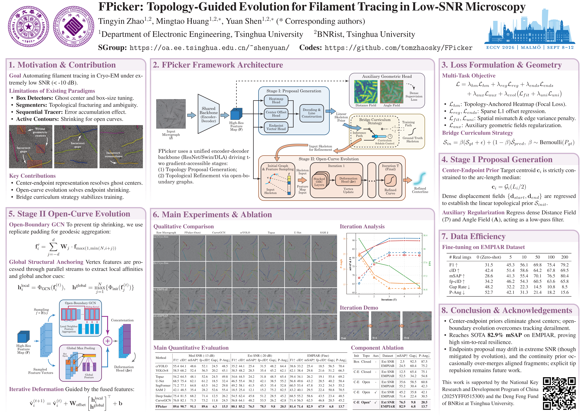

# FPicker: Topology-Guided Evolution for Filament Tracing in Low-SNR Microscopy

This is the official PyTorch implementation of the **ECCV 2026** paper:

**FPicker: Topology-Guided Evolution for Filament Tracing in Low-SNR Microscopy**  
*Tingyin Zhao, Mingtao Huang, Yuan Shen*  
Department of Electronic Engineering, Tsinghua University

  

  <em>Click on the poster above or <a href="https://www.youtube.com/watch?v=LkFeeidLxtY">here</a> to watch our ECCV 2026 presentation video on YouTube.</em>

The source code is released under the **GNU General Public License v3.0 (GPLv3)**.  
The datasets, annotations, masks, and pretrained weights are released for **non-commercial research use** under the **Creative Commons Attribution-NonCommercial 4.0 International License (CC BY-NC 4.0)**.

## Abstract

Automating filament tracing in Cryo-Electron Microscopy (Cryo-EM) is essential for 3D helical reconstruction but remains challenging under intersecting topologies and extremely low signal-to-noise ratios. Existing paradigms suffer from severe topological fragmentation, center drift, error accumulation, or artificial closed-curve constraints.

To address these challenges, we propose **FPicker**, a topology-guided framework for filament tracing in low-SNR microscopy. FPicker unifies perception through a center-endpoint representation and an open-curve evolution module, explicitly modeling non-cyclic filament connectivity. On simulated low-SNR Cryo-EM benchmarks, FPicker achieves strong tracing accuracy and improved topological continuity. It also demonstrates robust transfer potential on real-world Cryo-EM data.

## News

- **[Coming Soon]** The full codebase, pretrained weights, and synthetic Cryo-EM datasets will be released prior to the ECCV 2026 conference.
- **[2026.08]** Update the poster and presentation video.
- **[2026.06]** Our paper has been accepted to ECCV 2026! 🎉

## Repository Structure

~~~text
FPicker/
|-- backbone/        # Backbone networks
|-- config/          # Model, training, and data generation configs
|-- data/            # Dataset loader, augmentation, target generation, and simulator
|-- models/          # FPicker model and related modules
|-- utils/           # Losses, evaluation, training, and visualization utilities
|-- demo.py          # Single-image inference
|-- eval.py          # Quantitative evaluation
|-- test.py          # Test-set visualization
|-- train.py         # Training
|-- README.md
`-- LICENSE
~~~

## Installation

~~~bash
git clone https://github.com/tomzhaosky/FPicker.git
cd FPicker

conda create -n fpicker python=3.8.20
conda activate fpicker
~~~

Install PyTorch according to your CUDA version, then install the required packages:

~~~bash
pip install numpy opencv-python scipy pillow biopython tqdm torchvision
~~~

## Dataset

FPicker uses COCO-style synthetic Cryo-EM datasets (Cryo-Sim) or labeled EMPIAR datasets:

~~~text
cryosim/
|-- annotations/
|   |-- instances_train2025.json
|   |-- instances_val2025.json
|   `-- instances_test2025.json
|-- images/
|   |-- train2025/
|   |-- val2025/
|   `-- test2025/
`-- masks/
    |-- train2025/
    |-- val2025/
    `-- test2025/
~~~

Each annotation file contains topology-aware filament annotations, including ordered centerline points, sequential edges, bounding boxes, seed points, and image-level simulation parameters such as defocus.

If the dataset folder is placed outside `FPicker/`, specify its path with `--data_dir`.

## Training

~~~bash
python train.py --data_dir ./cryosim --arch resnet50 --gpus 0 --save_dir ./checkpoints
~~~

Supported backbones:

~~~text
resnet50 | dla34 | swin_t
~~~

Multi-GPU training with DDP:

~~~bash
CUDA_VISIBLE_DEVICES=0,1,2,3,4,5,6,7 torchrun --standalone --nproc_per_node=8 train.py \
  --data_dir ./cryosim \
  --arch resnet50 \
  --batch_size 12 \
  --gpus 0,1,2,3,4,5,6,7 \
  --save_dir ./checkpoints
~~~

Here, `--batch_size` denotes the per-GPU batch size. The effective global batch size is `batch_size x number_of_GPUs`.

Resume training:

~~~bash
python train.py --data_dir ./cryosim --resume --save_dir ./checkpoints
~~~

Train from pretrained weights:

~~~bash
python train.py --data_dir ./cryosim --teach_path path/to/pretrained.pth
~~~

## Evaluation

~~~bash
python eval.py --data_dir ./cryosim --model_path ./checkpoints/model_last.pth --arch resnet50
~~~

## Visualization

Test-set visualization:

~~~bash
python test.py --data_dir ./cryosim --model_path ./checkpoints/model_last.pth --save_dir ./results/vis --threshold 0.5
~~~

Single-image demo:

~~~bash
python demo.py --image_path path/to/image.png --model_path ./checkpoints/model_last.pth --output_path demo_result.jpg
~~~

## Citation

If you find FPicker useful in your research, please cite:

~~~bibtex
@inproceedings{zhao2026fpicker,
  title={FPicker: Topology-Guided Evolution for Filament Tracing in Low-SNR Microscopy},
  author={Zhao, Tingyin and Huang, Mingtao and Shen, Yuan},
  booktitle={European Conference on Computer Vision (ECCV)},
  year={2026}
}
~~~

## License

This repository uses separate licenses for code and data-related assets.

**Source code:** GNU General Public License v3.0 (GPLv3).  
**Datasets, annotations, masks, and pretrained weights:** Creative Commons Attribution-NonCommercial 4.0 International License (CC BY-NC 4.0).

Commercial use of the datasets, annotations, masks, or pretrained weights is not permitted without prior written permission from the authors.
